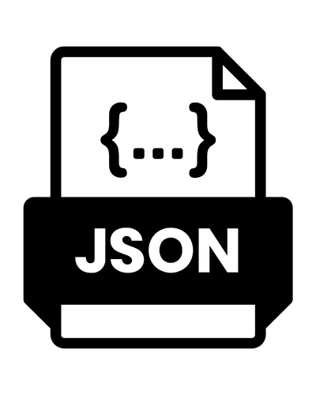

<div id="top"></div>
<!-- PROJECT LOGO -->
<br />
<div align="center" style="height:200px; margin-bottom:10%">
  <a>
    
  </a>
</div>

<!-- TABLE OF CONTENTS -->
<summary>Table of Contents</summary>
<ol>
<li>
	<a href="#about-the-project">About The Project</a>
	<ul>
	<li><a href="#built-with">Built With</a></li>
	</ul>
</li>
<li>
	<a href="#getting-started">Getting Started</a>
	<ul>
	<li><a href="#prerequisites">Prerequisites</a></li>
	<li><a href="#installation">Installation</a></li>
	</ul>
</li>
<li><a href="#usage">Usage</a></li>
<li><a href="#roadmap">Roadmap</a></li>
<li><a href="#contact">Contact</a></li>
<li><a href="#acknowledgments">Acknowledgments</a></li>
</ol>
</details>

<!-- ABOUT THE PROJECT -->
## About The Project
<!-- TODO Put images / gifs from the project here -->

**json_crypt** is a simple tool to encrypt and decrypt the values of JSON files, thus keeping the ability to search for specific key in the file and decrypt its value on-the-fly. It uses AES-256 in CBC mode to encrypt the data, with a given password as the key.

### Built With

* <a href="https://www.python.org/" target="_blank" title="Python's website">Python</a>
* <a href="https://pypi.org/project/pycryptodome/" target="_blank" title="pycryptodome's page">pycryptodome</a>
* <a href="https://regex101.com/r/SodelR/1" target="_blank" title="regex demo">regex</a>

<!-- GETTING STARTED -->
## Getting Started

### Prerequisites

* [Python 3](https://www.python.org/downloads/)
* [pycryptodome](https://pypi.org/project/pycryptodome/)

### Installation

1. Clone the repo

```sh
git clone https://github.com/kema-dev/json_crypt.git
```

2. Go to repository's folder

```sh
cd json_crypt
```

<!-- USAGE EXAMPLES -->
## Usage

1. Simply execute the script

```sh
python src/json_encrypt.py
```

<!-- ROADMAP -->
## Roadmap

See the [open issues](https://github.com/kema-dev/ft_transcendence/issues) for a full list of proposed features (and known issues).

Proper roadmap is available [here](roadmap.md).

<!-- CONTACT -->
## Contact

kema-dev - [GitHub](https://github.com/kema-dev)

## Acknowledgments

* [Img Shields](https://shields.io)
* [README.MD-Template](https://github.com/othneildrew/Best-README-Template)
